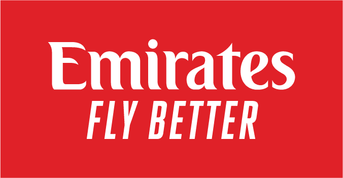

# Fly Better With Emirates

Based in Garhoud Dubai, Emirates is the largest airline of the United Arab Emirates.Owned by the governments  investment corporation of Dubai, Emirates Airlines circulates around 3,600 flights per week to 150 various cities and 80 countries.With this mammoth task of delivering thousands of flights per week. Emirates is the fourth largest airline by scheduled revenue which goes to show their competitive nature in the aviation industry.Founded in 1985, the airline company has continued to fly around the globe for years spreading its Middle Eastern Culture the company brings as originating from Dubai.

Flying around the world, having such an important font is key to spreading the brands identity especially within this industry as its technically free advertisement for the company. Being such a iconic brand,Emirates Airline has incorporated such a unique font within its brand that is clearly noticeable from a naked eye. To Promote their airline the company have had to come up with a distinctive font to represents the brands prestigious service it provides to its customers.

This corporate font which is named "EK or Emirates" is a custom typeface which has been designed exclusively for Emirates. Elements of this font have been inspired by the calligraphic forms of the Arabic typography especially within the logo. Furthermore this type reinforces the company's origins in the Middle East of where the company was founded and brought up, showing that Emirates is proud to promote its home in Dubai across the globe. The red background could depict this sense of love towards the company with the contrasted white which almost highlights the structure of a normal white coloured plane. However some could argue that the red could contain the distressing message of danger that the possibility of a crash incident would be on the cards or people who fear flying. Serifs have been used on this font which almost look like the nose of the plane or could potentially be the wings with this curved arch especially the letter E on "Emirates." Italics have been used on their slogan "Fly Better" almost giving this sense of flight or movement. Moreover, its their clear message to that customers would have a better experience on an Emirates airline and this sub text of it being in italics tries to emphasise this.