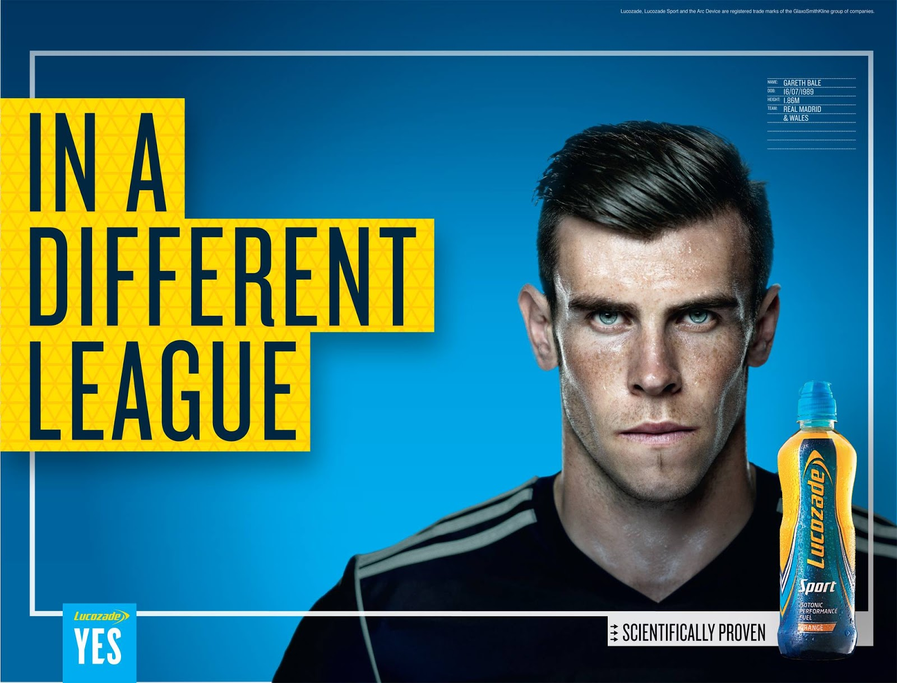

# History

Lucozade Sport is a popular energy drink fuelled with sugar and vitamins to help athletes gain that extra performance within their sport. In 1938 the energy drink was sold in the UK to help people who were ill.The drink was solely focused on giving patients energy when they felt at their lowest whilst feeling ill, Lucozade's slogan was "Lucozade aids recovery." It was only until the 1990s before it was more readily available as a sports drink in shops across the UK. The drink was sold in 1983 as a carbonated, slightly orange-flavoured drink in a glass bottle wrapped in yellow cellophane.

## Analysis

To reinforce this theme of sport into their branding, specific fonts have been chosen to give this sense of gaining energy and improved performance by consuming their drinks. For example, straight away the colour of the word "sport" is a bright yellow against a light blue background which is their main colour themes within their brand.This specific choice of yellow outputs the idea of having energy, like a depiction of a cartoon lightning bolt it resounds that Lucozade is a perfect choice if you want to have a boost of energy.

Talking of boosted energy, italics have been applied to the word lucozade almost representing a sprinting stance. A serif has been used at the end as well almost as the shape of an arrow showing a sense of direction with this boost of energy the company is trying to convey. Serifs on the word Lucozade can also all be seen pointing to the right whilst in an italic font as everything is in sync.

Within this Lucozade advert, Football athlete Gareth Bale has specifically been chosen to be included within this advert. Being one of the best players in football, the advert sends out a clear message that even the best athletes "supposedly" drink Lucozade in a way to push their brand and products to a specific target audience. 

Once again we can see the same colour themes of the light blue and yellow in this advert. The use of the background boxes around the typography of "in a different league" emphasises of the drinks quality to drastically improve your performance. The smaller white box consisting of the words "scientifically proven" is there to reassure consumers that lucozade's products are good for human consumption especially during sports. Adding this small bit of text in the bottom right corner goes to show that isn't their main body of text they are trying to convey in this advert as their have been several movements and discussions of trying to  lower sugars in energy drinks for the health and safety of the youths who mainly consume lucozade.