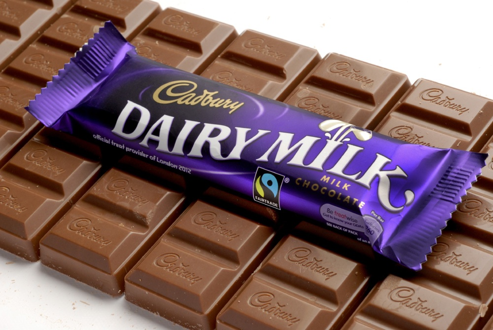
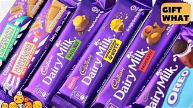

Cadbury Dairy Milk is a separate chocolate manufactured by the company Cadbury. It was first introduced in the United Kingdom in 1905 when it was circulated around the country in thousands of stores.It has become one of Cadburys all time sellers and was the best selling chocolate bar in 2014. Dairy Milk is a brand of chocolate that wants to provide this feeling of goodness and the best experience of milk chocolate because "every Dairy Milk is made with the best cocoa and the purest milk." Dairy Milk accounts for 40% market share followed by Nestle India with 20% market share. Due to our changing lifestyle there has been an increased demand for indulgent products as people prefer chocolates as an effective snack on-the-go. Traditional sweets have a psychological presence, the rise in the premium chocolates with attractive packaging has provided consumers a gifting alternative to sweets. Cadburys has had this distinctive purple colour since 2007 of it being Pantone 2865C. The wrapping has given the iconic chocolate bar a popular stand point. Cadburys popular slogan being "with a glass and a half of fresh milk." 

Cadbury's Dairy Milk is the market leader in the chocolate confectionary with presence in more than 200 countries, with powerhouses of brands such as Dairy Milk, Bourneville, Oreo, 5 star and temptation. This strong presence of over 200 countries has helped Cadburys have a tremendous distribution network across the globe, especially in India which has that 43.5% market share just for the Dairy Milk Brand. The company's main demographic consist of age groups from 5-40 from primary consumers, geographically urban and semi-urban areas. More targeted for customers who prefer indulging food such as quickly grabbing a chocolate whilst on the move.

When analysing Cadbury's Typography they have used used this familiar purple background to enhance the text of "Dairy Milk" which is white. The company has emphasised the typography to represent the milk which is used in the chocolate bar as its a milk chocolate bar. The font is relatively bold but is smooth and wavy to portray the motion of milk. This is reinforced with the imagery of the two glasses of milk being poured onto the letter "i" of the text. Moreover its the positioning of the text of both words, they're both not parallel on a straight line but you can see this arch which has been created once again to portray the flow of milk 

On the other hand the company's name Cadbury has been presented in this golden colour, almost as of it showing its prestige or the achievements it has experienced or just how popular the brand. The font used here, has this stitched style to it, embroided on the packing of its products. Almost resembling of the idea that is will permanently stay as it has a big part to play.