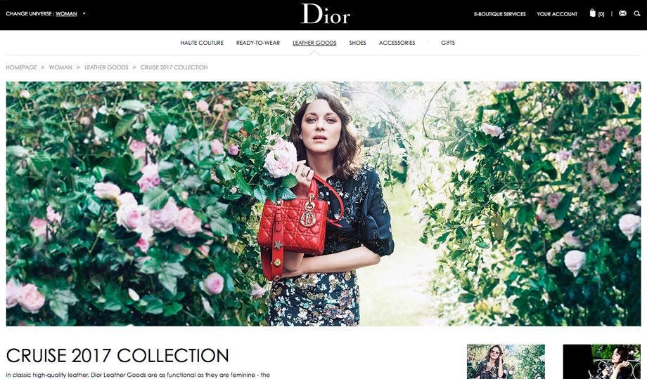

Christian Dior is a french luxury goods company, also a major main designer company which specialises in making high quality fashionable pieces of designer clothes. The company is French and is situated in Paris as where its headquarters is. The company was founded in 1946 by the french fashion designer Christian Dior, a common occurrence in high end brands where it was the original fashion designer determines the company's name e.g. Louis Vuitton, Giorgio Armani, Dolce & Gabbana. The Brand's visibility among its target audience and its social media presence has helped increase its brand equity. Moreover acquiring the likes of Rihanna, Johnny Depp and Natalie Portman as brand ambassadors has given the customers role models or aspirations to look up to, as all these celebrities have a large following and a huge interest into their fashion, 2 key elements to help a brand like Dior thrive within its industry.

Based in Paris which is notoriously known for its fashion, the company evolves around presenting themselves as this prestigious unique and high quality designer outlet. The French luxury company owns brands like LVMH, Watch & jewelry brands like Tag Heuer, Zenith, De Beers and brands in production categories Wines & Spirits, fashion & Leather goods, perfumes & cosmetics. Comes a designer brand comes a designer font. 

Dior's font is a century gothic arial font which contains several serifs. The font helps well to create a sense of style, class and sophistication. Its thin font gives it the impression of elegance and this fashionable design correlates to it being based in Paris, where fashion is at the heart of France. Its choice of having the font a lot smaller than the entire box, comes with the point that the brand is so prestigious and high end that financially they can afford having wasted space. This is completely different to brands like Argos, Blockbusters and Greggs who all depend on having a big bold font, with a square around it but has very little room allowing the font to stand out more. However with Dior it's clearly evident that they don't need that element of trying to make their brand stand out, as the four letters there already do the job of highlighting the brand's quality.