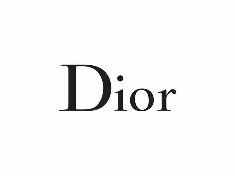

Christian Dior is a french luxury goods company, also a major main designer company which specalises in making high quality fashionable pieces of designer clothes. The company is French and is situated in Paris as where its headquarters is. The company was founded in 1946 by the french fashio designer Christian Dior, a common occurence in high end brands where it was the original fashion designer determines the companys name e.g. Louis Vuitton, Giorgio Armani, Dolce & Gabbana. 

Based in Paris which is notoriously known for its fashion, the company evolves around presenting themselves as this prestigious unique and high quality designer outlet. Comes a designer brand comes a designer font.

Dior's font is a century gothic arial font which contains several serifs. The font helps well to create a sense of style, class and sophistication. Its thin