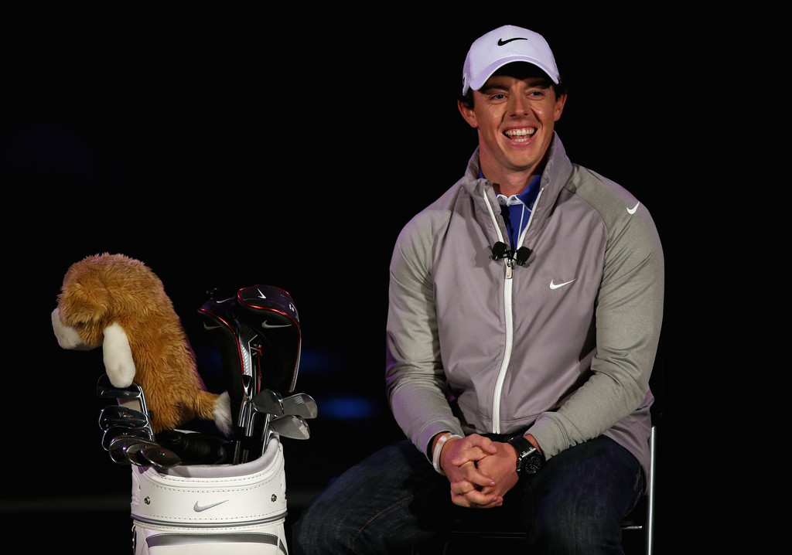
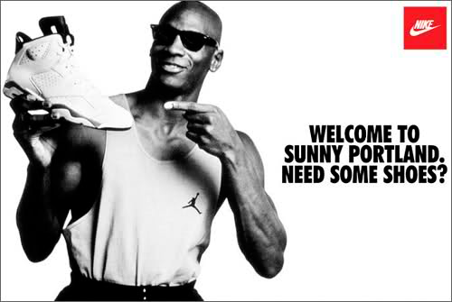
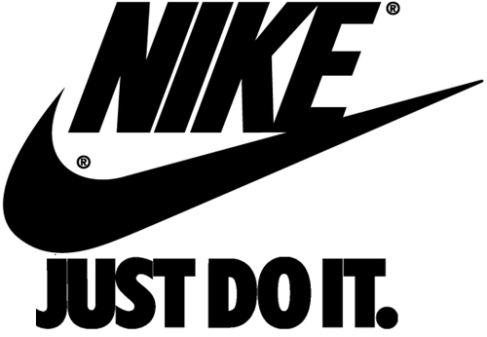

Nike is an American multination corporation that is engaged in the design, development, manufacturing if sports apparel. With its headquarters situated in Beaverton Oregon, Nike have been making sports apparel since 1964 when the company was previously known as the Blue Ribbon Sports inc. It has 75,400 employees around the globe with its intention of becoming the best when it comes to manufacturing and distributing its apparel in the sporting industry with a revenue of $37.4 billion in its fiscal year 2020 ending in may. The brand is expected to be valued around $32 billion making it the most valuable brand amongst sports businessman.

Just like any other large companies, Nike also uses hundreds of Nike ambassadors, influencers to promote their brand and this done to help target specific audiences from different sports. Role models who are inspired by their followers, the sight of them wearing Nike's apparel would collectively mean that a lot of their online followers would want to do the same to replicate their behaviour. For example, the above photo is Michael Jordan, one of the greatest players basketball has ever seen.Despite owning the brand Jordan, he is promoting his shoe the Jordan 6 which is a direct collaboration with Nike. Having this huge sportsman and role model working with Nike brings a huge audience over, as millions of people look up to Michael Jordan and would want to be just like him so promoting the Jordan 6 would intrigue hundreds of thousands of customers to purchase that exact product.

Within Nike's font to portray its action of working in the sporting industry has used the Italicized Impact font a sans serif typeface created by Geoffrey Lee in 1965  with a swoosh to show Nike's main logo being the swoosh. This bold italisced font has been used to make the font stand out. The choice of the font being italisced gives me the impression of movement, as if the the font is running in the direction towards the right, like the sport running Nike is outpouring this sense of movement and the inclusion of sport which its company evolves around. 

The company's use of the swoosh is their main logo and makes Nike recognisable even if you were to remove the name nike. Nike also uses their popular slogan "just do it" the imperative "do it" gives the viewer that urge to participate in sports. Furthermore the Italisced impact font again in used in their slogan as they make this bold statement to emphasis their slogan which is trying to motivate viewers to participate. As from a financial perspective for the company the more people who play sports would mean more people viewing their website to buy any of their sports apparel to help enhance their performance or to provide the right clothing and gear for their customers.