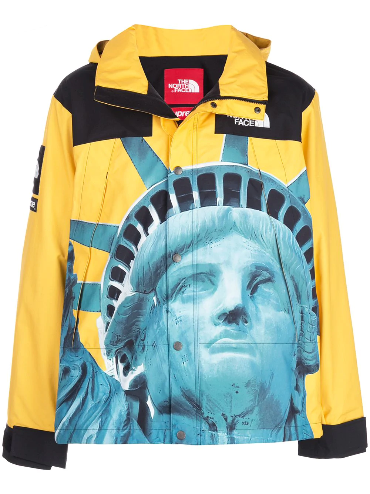
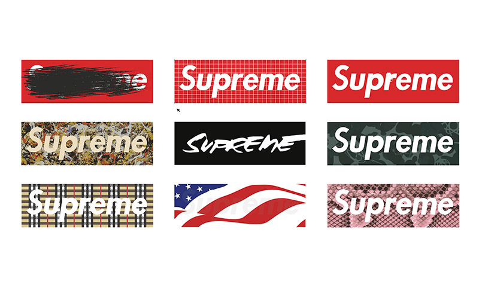
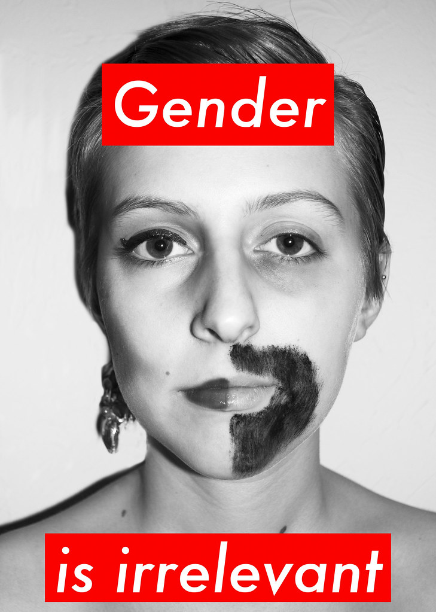
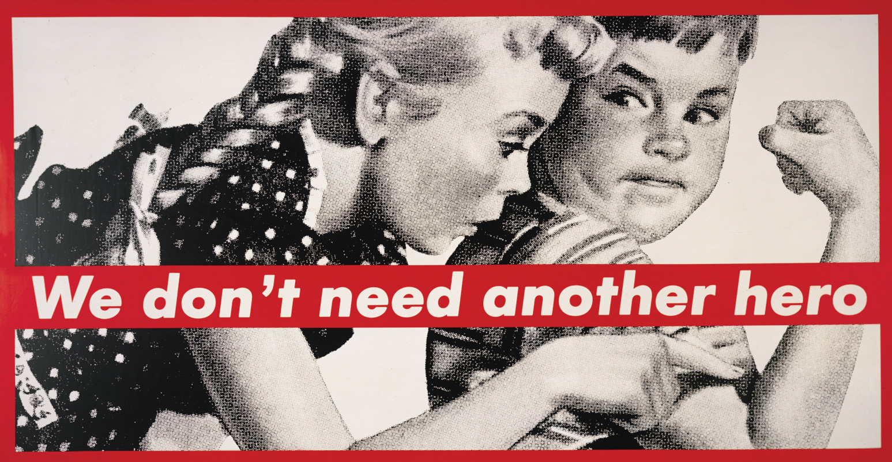

Established in 1994, Supreme has become one of the worlds most popular skating brands. Originally started in New York City, the company targeted the skateboarding and hip hop cultures. Supreme mainly produces clothes, accessories and also skateboards. Products to which all orientate around the skating industry.However with the brand becoming so successful, new releases come through their retail locations around the world on thursday mornings. However the company releases a small amount of stock per product. This makes the item more desirable and creates more of a hype as theres less of the product to be sold. Therefore this hype has created the company desirable in that customers come over to their stores or online to obtain their products which are not as sold in larger quantities making the customer feel privileged that they have a not so common product.

Furthermore to make their clothing line or products more desirable, Supreme have done deliberate collaborations with other popular brands such as North Face, The Bathing Ape, Nike and Jordan. The result of this, gives the company a larger audience who will come to their site as these customers have come from different brands they follow. Once again their collaboration with North Face of manufacturing the Supreme x The North Face Mountain Jacket, had caused a huge sensation of hype as both brands came together to make a mountain jacket which includes the Statue of Liberty on the front. However with a lot of customers who buy either companies products, it should come to attention that its the sight of seeing both of the brands names/labels on the clothing so the customer can show off their high end piece of clothing they have acquired in its small quantity.

The Red Box logo is the companies main logo when it comes to displaying Supreme. The actual font of the name in white is Futura Heavy Oblique which has heavily based off of Barbaras Kruger's propaganda art. Kruger was heavily involved within the feminist movements in the 1980s in America, she used art to portray messages and to encourage a movement for womens' rights. An inspiration Supreme has used to display their brand. 

